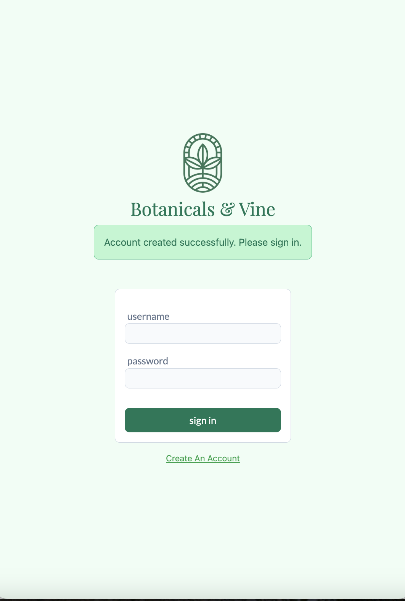
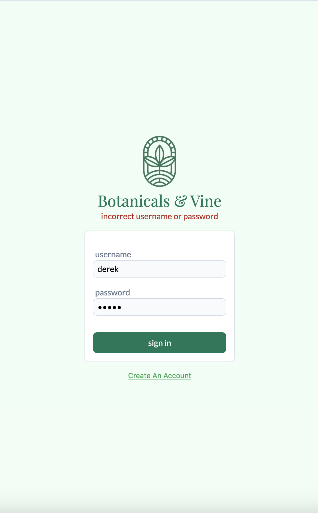
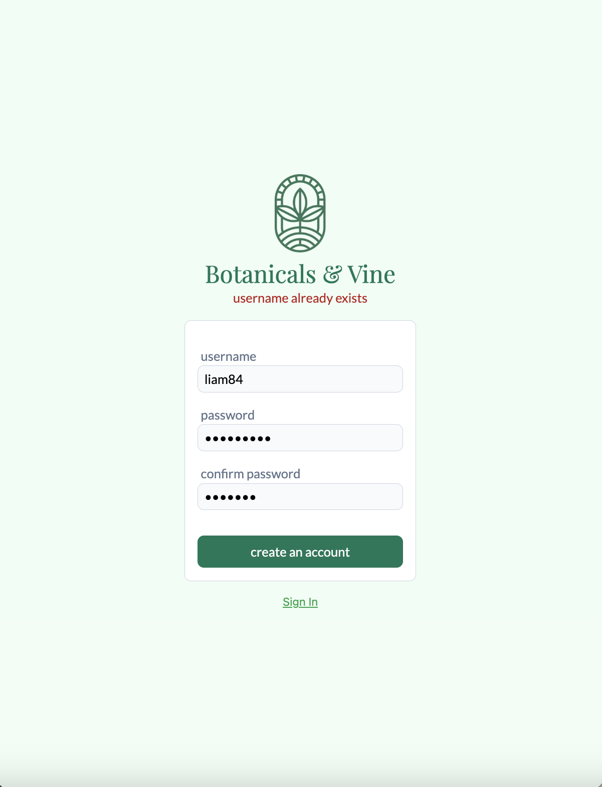
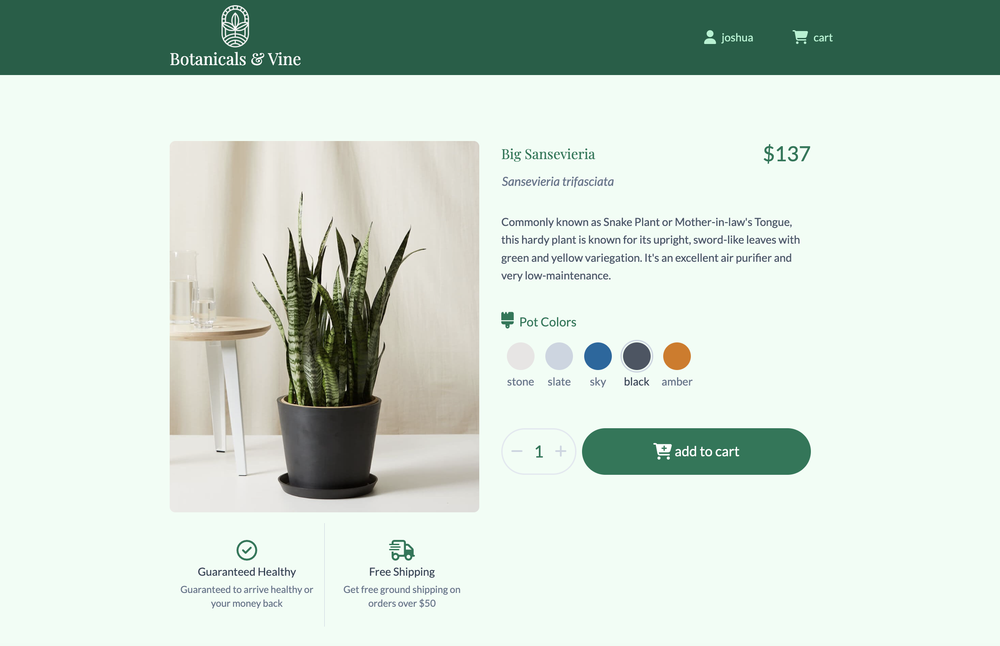
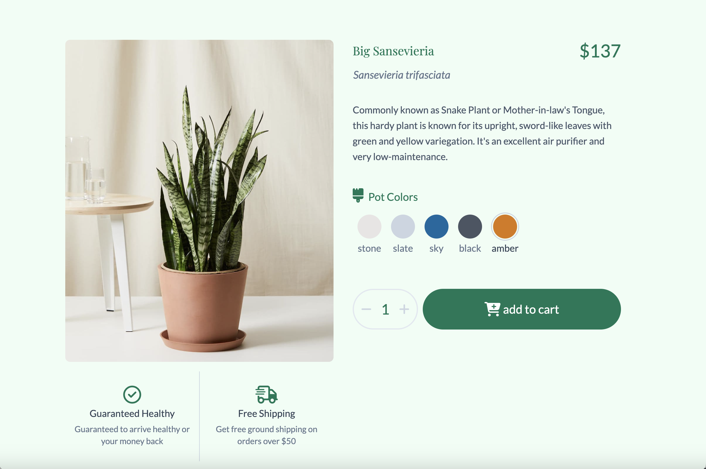

# Botanicals & Vine ~

For my home plant lovers. This frontend project serves as a comprehensive **Proof of Concept (PoC)** for a digital plant e-commerce shop. This is simply a MVP, more features coming soon :) .

---

## 🛠️ Tech Stack

| Category             | Technology                             |
| :------------------- | :------------------------------------- |
| **Framework**        | React (Vite)                           |
| **Styling**          | Tailwind CSS, Google Fonts             |
| **State Management** | React Hooks (Context API)              |
| **Testing**          | Vitest, React Testing Library, Cypress |
| **Icons**            | Font Awesome                           |
| **Version Control**  | Git / GitHub                           |

---

## ✨ Key Features

### 🔐 Authentication & Error Handling

A robust onboarding flow that handles both success and failure states gracefully.

- **Session Management:** Persists user login state across reloads.
- **Real-time Validation:** Provides immediate visual feedback for incorrect credentials or formatting errors.

|                                Sign Up Success                                 |                                    Login Error Handling                                    |
| :----------------------------------------------------------------------------: | :----------------------------------------------------------------------------------------: |
|  |  |

> **Validation Logic:**
> 
> _Prevents submission of invalid data to ensure backend integrity._

---

### 🍃 The Greenhouse (Catalog)

A high-performance grid layout that fetches and displays plant data dynamically.

- **Responsive Grid:** Adapts from mobile (1 col) to desktop (4 cols) using Tailwind breakpoints.
- **Visual Hierarchy:** Prioritizes high-quality imagery with clear pricing and naming conventions.

---

### 🛒 Custom Shopping Experience

The application handles complex product logic, such as selecting specific pot colors for the same plant species.

- **Product Details:** Dedicated views for care instructions and specifications.
- **State Logic:** The cart differentiates between a _Blue Star Fern (Terracotta)_ and a _Blue Star Fern (White)_, treating them as unique line items.

> **Live Cart Demo:**
>
> _Users can customize their order and see the cart update instantly._
>
> 
> _(Note: If video does not play, please view in `assets/add_blue_to_cart.mp4`)_

---
